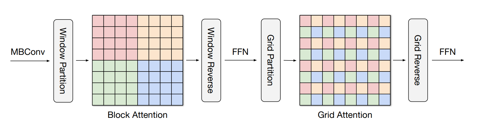
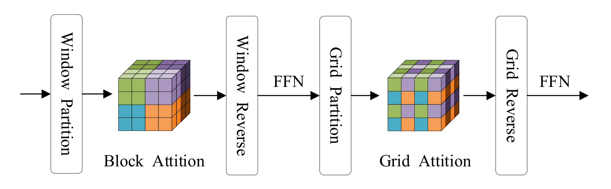

# 3D-MaxViT-pytorch
Extending MaxViT (Multi-Axis Vision Transformer) to 3D Space

## MaxViT
[MaxViT:Multi-Axis Vision Transformer](https://arxiv.org/abs/2204.01697).  In this paper author introduce an efficient and scalable attention model , call multi-axis attention, which consists of two aspects: blocked local and dilated global attention.
 
 
 

## 3D MaxViT
We extend MaxViT to 3D space to accommodate medical images such as CT and MRI. We implemented 3D Max-SA(3D Multi-axis self-attention) as shown in the figure to facilitate insertion into existing medical networks such as 3DUnet.
 
 
 

## Acknowledgement
We refer to part of the code of [vit-pytorch/maxvit](https://github.com/lucidrains/vit-pytorch)